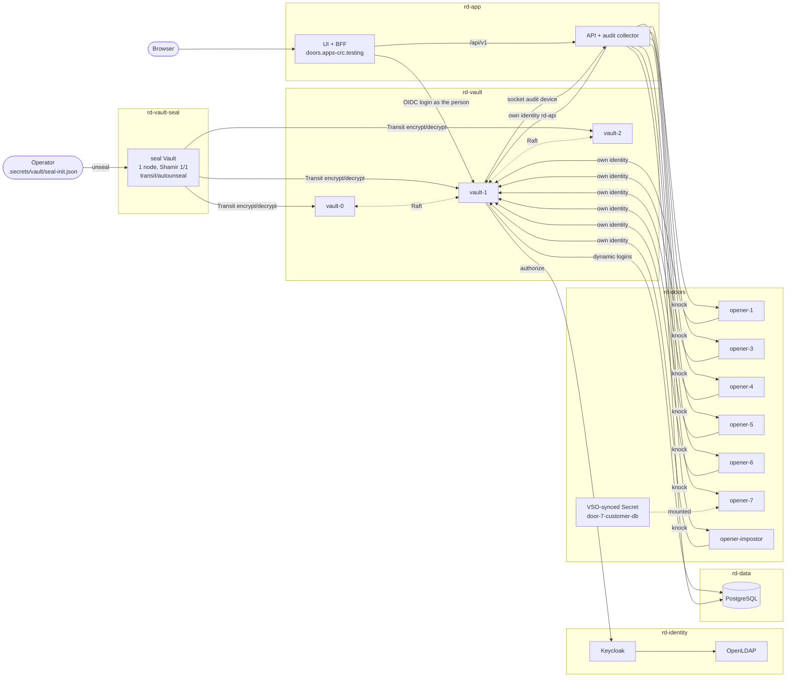

# Architecture

Everything runs in one OpenShift Local VM. Six namespaces, two Vaults, one
Vault Enterprise namespace (`red-doors`) that holds every door.

## Namespaces

| Namespace | Runs | Notes |
| --- | --- | --- |
| `rd-vault-seal` | seal Vault (1 pod, PVC) | the root of trust; unsealed by an operator |
| `rd-vault` | Vault Enterprise 2.1, 3 Raft voters (PVCs) | auto-unsealed via the seal Vault's Transit key |
| `rd-identity` | OpenLDAP (built from Alpine in-cluster), Keycloak 26 | people and groups for doors 2 and 8 |
| `rd-data` | PostgreSQL 16 | payroll rows (door 4), merger ciphertext (door 6), API schema |
| `rd-doors` | seven openers + their service accounts | each opener is one identity |
| `rd-app` | API (Express 5) and UI (Nuxt 4 SPA + Nitro BFF) | orchestration and presentation only |

The Vault Secrets Operator runs in `openshift-operators` (OperatorHub).
Every namespace has NetworkPolicies: openers accept traffic only from the
API, the API only from the UI (and Vault on the audit port).

Workloads are pinned to the `restricted-v2` SCC with the annotation
`openshift.io/required-scc`, run as non-root with a read-only root
filesystem, and images are built inside the cluster with OpenShift builds
(`oc start-build --from-dir`), rebuilt only when the source hash changes.

## The seal chain

1. The **seal Vault** uses Shamir with one share. Its unseal key and root
   token are in `.secrets/vault/seal-init.json`. `make vault-unseal` (also
   step 4 of `make up`) unseals it.
2. It holds a Transit key `autounseal` and a **periodic, orphan token**
   (period 720 h) with policy `autounseal`: encrypt/decrypt on that key,
   nothing else. The token is stored as Secret `vault-seal-token` in
   `rd-vault`.
3. The **main cluster** has `seal "transit"` pointing at the seal Vault.
   Each pod starts with an init container `wait-for-seal-vault`; without
   it Vault exits when the seal Vault is sealed and the pod crash-loops.
4. The main cluster's own recovery keys are in
   `.secrets/vault/cluster-init.json`; they are never needed for unsealing.

Restart the seal Vault and the main cluster keeps serving (it is already
unsealed). Cold-start everything and the main nodes wait, then unseal
themselves seconds after the seal Vault does. See scenarios
[02](../scenarios/02_seal_vault_restart/README.md) and
[03](../scenarios/03_cold_start/README.md).

## Vault topology

- Helm chart 0.34.1, `global.openshift=true`, image digest-pinned.
- TLS everywhere with the project CA (`vault-tls/ca.pem`); Routes
  `vault.apps-crc.testing` (active node) and `vault-seal.apps-crc.testing`
  use passthrough TLS.
- Readiness probe: HTTPS `sys/health` that treats standbys as ready;
  liveness off (a sealed node must not be killed in a loop).
- `api_addr` is the chart default `https://$(POD_IP):8200`.
- The StatefulSet updates `OnDelete`; `make vault-roll` restarts standbys
  first and the leader last.

All door configuration lives in Vault Enterprise namespace **`red-doors`**
and is managed by Terraform (`terraform/*`, state in
`.secrets/terraform/`). The admin token used by Terraform is periodic
(720 h) with policy `rd-admin`; the root token is used only by the
one-time bootstrap.

## Identities per door

| Door | Identity Vault evaluates | Auth method / role | Policy |
| --- | --- | --- | --- |
| 1 | SA `rd-doors:opener-1` | `kubernetes` / `opener-1` | `door-1` |
| 2 | the signed-in person (Keycloak → LDAP group `board`) | `oidc` / `visitor` + identity group | `door-2` |
| 3 | role-id in opener-3 + wrapped secret-id | `approle` / `door-3` | `door-3` |
| 4 | SA `rd-doors:opener-4` | `kubernetes` / `opener-4` | `door-4` → `database/creds/payroll-reader` |
| 5 | SA opener-5 (issuer), then `CN=opener-5.rd-doors` | `kubernetes` / `opener-5-issuer`, then `cert` / `treasury` | `door-5-issuer`, then `door-5` |
| 6 | SA `rd-doors:opener-6` | `kubernetes` / `opener-6` | `door-6` (decrypt only) |
| 7 | VSO, as SA `rd-doors:vso-door-7` | `kubernetes` / `vso-door-7` | `door-7` |
| 8 | the requester, then a different approver | `oidc` + groups `requesters` / `approvers` | `door-8-request` (control group), `door-8-approve`, EGP `door-8-two-different-people` |
| — | SA `rd-doors:impostor` (pod `opener-impostor`) | `kubernetes` / `impostor` | `impostor` (lobby only) |

Machine tokens are short (TTL 2–5 min) and every opener revokes its token
right after use. Full policy text: [doors.md](doors.md).

## Audit flow

Vault has **two** audit devices:

- **`stdout/`** (file device writing to stdout): always on, so Vault never
  blocks for lack of an audit sink. OpenShift keeps it with the pod logs.
- **`red-doors-collector/`** (socket device) → `red-doors-api-audit:9090`,
  a TCP collector inside the API. It parses each record, tags it with a
  door, and stores it in PostgreSQL (`api.audit_entries`).

Every knock records the Vault **request ids** it caused; the UI's "Vault
audit entries" drawer joins on them. Values Vault HMACs stay HMAC'd. If the
collector is down, Vault keeps serving through the stdout device and
reconnects the socket by itself ([scenario 04](../scenarios/04_collector_offline/README.md)).

## API and BFF boundaries

- **UI + BFF** (`rd-app/red-doors-ui`): a Nuxt SPA served by Nitro. Sign-in
  is a Vault OIDC login done server-side; the person's Vault token and any
  door-8 wrapping tokens live in a server-side session (cookie
  `rd_session`, httpOnly). The browser never holds a Vault token.
- **API** (`rd-app/red-doors-api`): logs in as itself (Kubernetes role
  `red-doors-api`, policy `rd-api`). It orchestrates knocks, reads policy
  text for display, mints door-3 secret-ids that Vault forces to be
  wrapped, and stores attempts. **It cannot read any door secret** and it
  never stores a released value. Its own PostgreSQL login is a Vault
  dynamic credential (`database/creds/api-rw`), renewed against the wall
  clock and re-minted if PostgreSQL refuses it.
- Doors 2 and 8 are decided with the **person's** token, which the BFF
  passes to the API per request; the API's own token is never used to
  open them.

Contract: [`openapi/red-doors.yaml`](../openapi/red-doors.yaml) (16 operations).
